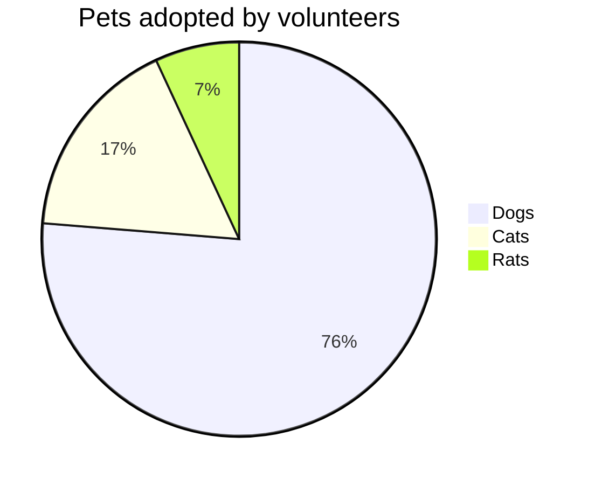

# Emoji

I give this plugin two :+1:!

# Math

$ a * b = c ^ b $

$ 2^{\frac{n-1}{3}} $

$ \int\_a^b f(x)\,dx. $

# Tables

|              Stage | Direct Products | ATP Yields |
| -----------------: | --------------: | ---------: |
|         Glycolysis |          2 ATP              ||
| ^^                 |          2 NADH |   3--5 ATP |
| Pyruvaye oxidation |          2 NADH |      5 ATP |
|  Citric acid cycle |          2 ATP              ||
| ^^                 |          6 NADH |     15 ATP |
| ^^                 |          2 FADH |      3 ATP |
|                               30--32 ATP        |||

| :    Easy Multiline   : |||
| :----- | :----- | :------ |
| Apple  | Banana | Orange  \
| Apple  | Banana | Orange  \
| Apple  | Banana | Orange
| Apple  | Banana | Orange  \
| Apple  | Banana | Orange  |
| Apple  | Banana | Orange  |

# UML

```plantuml!
Bob -> Alice : hello world
```


